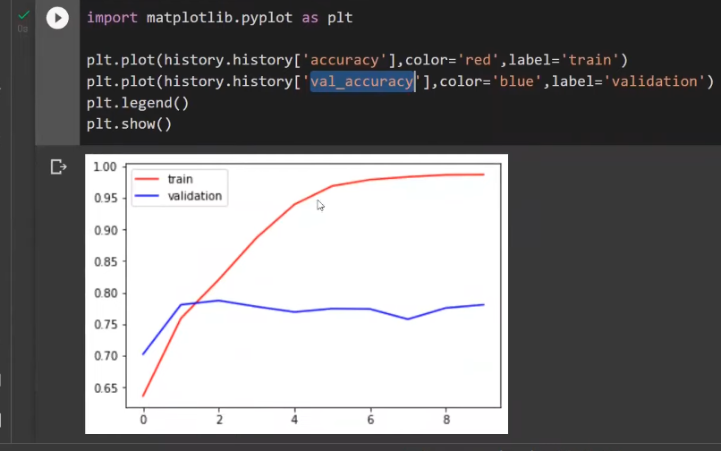

# Deep-learning-project
(**cats-vs-dogs-classification**)

## CNN を使用した猫と犬の分類

畳み込みニューラル ネットワーク (CNN) は、畳み込み層を適用することによって動作し、conv2d などの演算を利用して学習したフィルター (カーネル) を入力画像と畳み込みます。 これらのフィルターは、画像のさまざまな側面に重みとバイアスを割り当て、特徴抽出を支援します。
バッチ正規化を適用して、バッチ全体で入力を正規化することで学習を強化します。 
 ネットワーク パラメーターは、予測とラベルの間の距離を最小化するために反復的に調整されます。 このプロセスはバッチごとに繰り返され、ネットワークの予測機能が徐々に向上します。...
 バッチ正規化する前の結果として
 　
　
